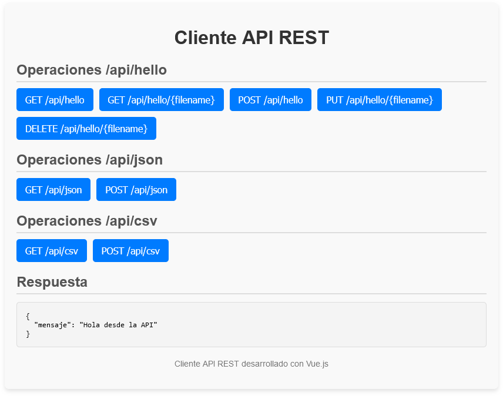

# **Cliente API REST**

## **Descripción**

Este proyecto es un cliente web que consume una API REST para gestionar datos en diferentes formatos: Storage (clase genérica), JSON, y CSV. El cliente permite realizar operaciones CRUD (Crear, Leer, Actualizar, Eliminar) sobre los datos mediante una interfaz sencilla.

El backend expone una API REST implementada con Node.js y Express, mientras que el frontend utiliza Vue.js como framework. Docker se utiliza para contenerizar ambos servicios y facilitar la ejecución del entorno de desarrollo.

## **Requisitos**

Antes de comenzar, asegúrate de tener instalados los siguientes programas:

    Node.js (versión recomendada: 16 o superior)
    Docker
    Docker Compose

## **Instrucciones para su ejecución**

Clonar el Repositorio

    git clone https://github.com/Tallulah88/PR_UD2
    cd PR_UD2

Levantar el Entorno con Docker

    docker compose up -d

Acceder a los Servicios

    Frontend: http://localhost:8080
    Backend: http://localhost:3000

Detener los Servicios

    docker compose down

## **Funcionalidades**

El cliente permite realizar las siguientes operaciones sobre la API REST:
Clase Storage (/api/hello)

    GET /api/hello: Obtiene un mensaje de bienvenida.
    GET /api/hello/{filename}: Obtiene información sobre un archivo.
    POST /api/hello: Crea un archivo.
    PUT /api/hello/{filename}: Actualiza el contenido de un archivo.
    DELETE /api/hello/{filename}: Elimina un archivo.

JSON (/api/json)

    GET /api/json: Lista todos los archivos JSON.
    GET /api/json/{filename}: Obtiene un archivo JSON específico.
    POST /api/json: Crea un archivo JSON.
    PUT /api/json/{filename}: Actualiza un archivo JSON.
    DELETE /api/json/{filename}: Elimina un archivo JSON.

CSV (/api/csv)

    GET /api/csv: Lista todos los archivos CSV.
    GET /api/csv/{filename}: Obtiene un archivo CSV específico.
    POST /api/csv: Crea un archivo CSV.
    PUT /api/csv/{filename}: Actualiza un archivo CSV.
    DELETE /api/csv/{filename}: Elimina un archivo CSV.
