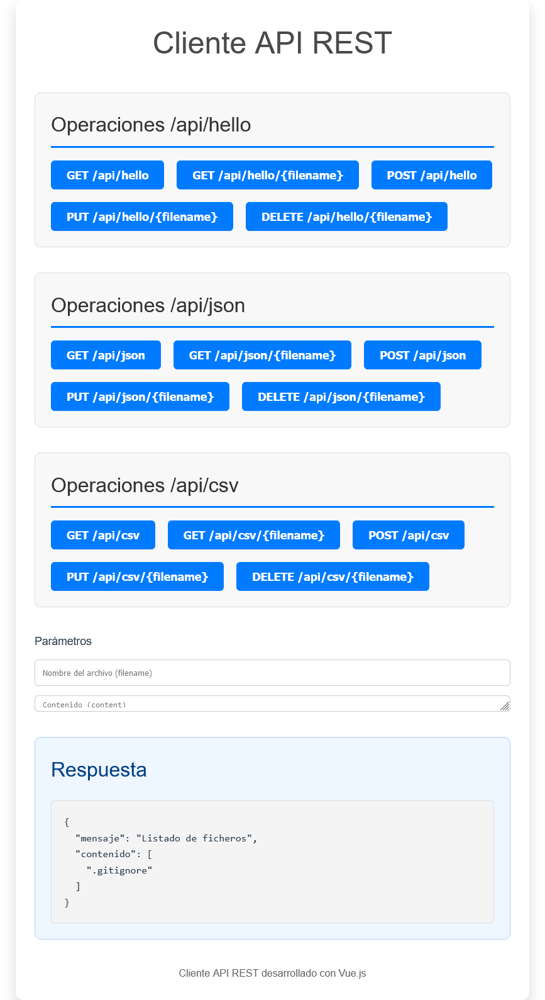

## **Descripción**

Este proyecto es un cliente web que interactúa con una API REST para gestionar datos en diferentes formatos: Archivos de texto genéricos (clase HelloWorld), JSON y CSV. Permite realizar operaciones CRUD (Crear, Leer, Actualizar, Eliminar) sobre estos datos de manera sencilla mediante una interfaz moderna desarrollada con Vue.js.

El backend utiliza Laravel como framework para exponer la API REST, mientras que el frontend está construido con Vue.js. Docker se emplea para contenerizar ambos servicios (frontend y backend) junto con una base de datos MySQL, facilitando la configuración y ejecución del entorno de desarrollo.

## **Requisitos**

Antes de comenzar, asegúrate de tener instalados los siguientes programas:

    Docker
    Docker Compose

## **Instrucciones para su ejecución**

Clonar el Repositorio:

    git clone https://github.com/Tallulah88/PR_UD2
    cd PR_UD2

Levantar el Entorno con Docker:

    docker compose up -d

Acceder a los Servicios:

    Frontend:
    http://localhost:5173
    
    Backend:
    http://localhost:8000

Detener los Servicios:

    docker compose down

## **Funcionalidades**

El cliente permite realizar las siguientes operaciones sobre la API REST:

HelloWorld (Storage) (/api/hello)

    GET /api/hello: Lista todos los archivos en el almacenamiento.
    GET /api/hello/{filename}: Obtiene el contenido de un archivo específico.
    POST /api/hello: Crea un archivo con un nombre y contenido especificados.
    PUT /api/hello/{filename}: Actualiza el contenido de un archivo existente.
    DELETE /api/hello/{filename}: Elimina un archivo existente.

JSON (/api/json)

    GET /api/json: Lista todos los archivos JSON válidos.
    GET /api/json/{filename}: Obtiene el contenido de un archivo JSON específico.
    POST /api/json: Crea un archivo JSON con un nombre y contenido proporcionados.
    PUT /api/json/{filename}: Actualiza el contenido de un archivo JSON existente.
    DELETE /api/json/{filename}: Elimina un archivo JSON específico.

CSV (/api/csv)

    GET /api/csv: Lista todos los archivos CSV disponibles.
    GET /api/csv/{filename}: Obtiene el contenido de un archivo CSV específico.
    POST /api/csv: Crea un archivo CSV con un nombre y contenido proporcionados.
    PUT /api/csv/{filename}: Actualiza el contenido de un archivo CSV existente.
    DELETE /api/csv/{filename}: Elimina un archivo CSV específico.
